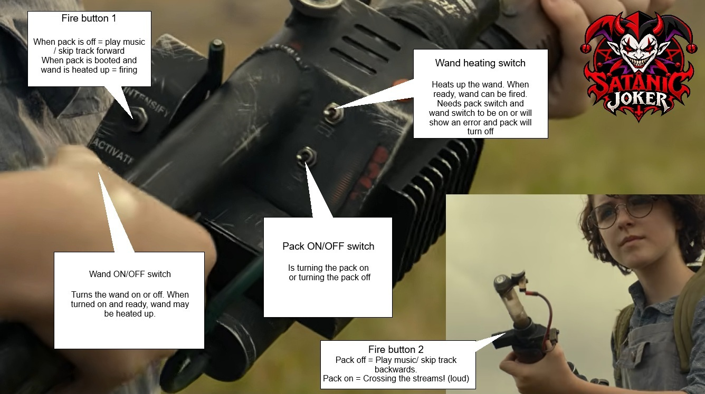
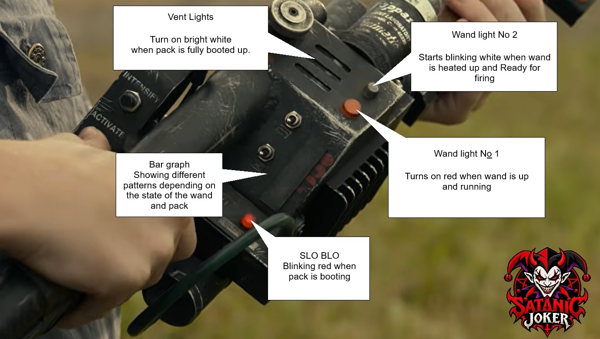

# SataniC JokeR's Afterlife 2026 Proton Pack

 
Firmware, libraries & sound installation guide

**Project:** Ghostbusters Afterlife 2026 by SataniC JokeR / Acki  
**Controller:** Classic Arduino Nano (ATmega328P)

This guide covers installing the `SataniCJokeR_Afterlife_2026` Arduino firmware and its matching audio files, including the custom libraries, DFPlayer Mini microSD card, wiring reference, first startup, and troubleshooting.

> **Important:** The `.ino` file alone is not a complete installation. You also need the matching custom library files and pack sounds.

## 1. Before you begin

| Required item | Purpose |
| --- | --- |
| Classic Arduino Nano | Runs the firmware |
| DFPlayer Mini and microSD card | Play pack effects and optional music |
| USB data cable and Arduino IDE | Compile and upload the sketch |
| `SataniCJokeR_Afterlife_2026.ino` | Main firmware |
| Pack WAV files `0001.wav`–`0032.wav` | Original effects and prepared crossfade transitions |
| Custom `BGSequence` and `GBLEDPatterns` files | Project-specific bargraph and LED code |

## 2. Install Arduino IDE and select the board

1. Download and install the [Arduino IDE](https://www.arduino.cc/en/software).
2. Connect the Nano using a USB data cable. If necessary, install **Arduino AVR Boards** through **Tools → Board → Boards Manager**.
3. Select **Tools → Board → Arduino AVR Boards → Arduino Nano**, then **Tools → Processor → ATmega328P**.
4. Select the correct USB/COM port under **Tools → Port**. If an older Nano or compatible clone will not upload, try **ATmega328P (Old Bootloader)**.

## 3. Install the required libraries

The sketch includes six headers:

| Header / library | Installation method / role |
| --- | --- |
| `DFPlayerMini_Fast.h` | Install [DFPlayerMini_Fast](https://github.com/PowerBroker2/DFPlayerMini_Fast) through Arduino Library Manager; DFPlayer control. |
| `FastLED.h` | Install [FastLED](https://github.com/FastLED/FastLED) through Arduino Library Manager; addressable LEDs. |
| `Adafruit_NeoPixel.h` | Install [Adafruit NeoPixel](https://github.com/adafruit/Adafruit_NeoPixel) through Arduino Library Manager; LED strips. |
| `SoftwareSerial.h` | Provided by the Arduino AVR platform; normally no separate installation. |
| `BGSequence.h` + `BGSequence.cpp` | Matching project-specific files for the 28-segment bargraph. |
| `GBLEDPatterns.h` | Matching project-specific Proton Pack LED code. |

In Arduino IDE, open **Tools → Manage Libraries**, search for each third-party library by its exact name, and click **Install**. You can also install a library ZIP through **Sketch → Include Library → Add .ZIP Library**.

**Use the matching custom project files.** Unrelated libraries with similar names are not substitutes.

## 4. Arrange and upload the sketch

Keep the sketch and its matching custom source files together:

```text
SataniCJokeR_Afterlife_2026/
├── SataniCJokeR_Afterlife_2026.ino
├── BGSequence.h
├── BGSequence.cpp
└── GBLEDPatterns.h
```

1. Open `SataniCJokeR_Afterlife_2026.ino` in Arduino IDE.
2. Click **Verify**. Resolve any missing-library errors before uploading.
3. Confirm the Nano board, processor, and USB/COM port, then click **Upload**.

The firmware is installed on the Arduino Nano. **The audio files go on the DFPlayer's microSD card**, not in the `.ino` file or the Nano's flash memory.

## 5. Prepare the DFPlayer microSD card

1. Back up the card, then format a compatible microSD card as **FAT32**. A card of 32 GB or less is a practical starting point; avoid exFAT.
2. At the **root** of the card, create two folders with these exact names: `mp3` and `01`.
3. Copy all original and crossfade pack effects into `/mp3`, with four-digit WAV filenames from `0001.wav` through `0032.wav`.
4. Copy optional music into `/01`, with three-digit MP3 filenames such as `001.mp3`, `002.mp3`, and `003.mp3`.

```text
microSD card/
├── mp3/
│   ├── 0001.wav
│   ├── 0002.wav
│   ├── ...
│   └── 0032.wav
└── 01/
    ├── 001.mp3
    ├── 002.mp3
    └── ...
```

**Why is the WAV folder named `mp3`?** `mp3` is the DFPlayer's special folder name. It **does not** mean the pack WAV files should be converted to MP3. The sketch calls `playFromMP3Folder()` to address this folder.

Keep the original sounds and crossfades together:

- `0001.wav`–`0021.wav`: original pack sounds.
- `0022.wav`–`0032.wav`: prepared transition WAV files.
- `0032.wav`: the current complete Vent sequence, combining Vent, Post Vent, Boot After Vent, and Idle 3.
- `0029.wav`–`0031.wav`: reserve/pair-test transitions.

Keep the **supplied audio format and timing**. For replacement pack files, 16-bit PCM WAV at 44.1 kHz is a sensible target, but timing-sensitive replacements may also require firmware changes.

If the DFPlayer selects the wrong track, back up and reformat the card, then copy the numbered files in ascending order. Avoid duplicate numbers and hidden metadata files. Safely eject the card and switch off the DFPlayer before inserting or removing it.

## 6. Audio file reference

| Filename | Sound / transition |
| --- | --- |
| `0001.wav` | Power On |
| `0002.wav` | Boot |
| `0003.wav` | Pack Idle (Idle 1) |
| `0004.wav` / `0005.wav` / `0006.wav` | Ramp 1 On / Idle / Down |
| `0007.wav` / `0008.wav` / `0009.wav` | Ramp 2 On / Idle / Down |
| `0010.wav` / `0011.wav` / `0012.wav` | Fire / Fire Loop / Fire Tail |
| `0013.wav` / `0014.wav` / `0015.wav` | Alarm / Vent / Off |
| `0016.wav` / `0017.wav` / `0018.wav` | Boot After Vent / Error / Error Off |
| `0019.wav` / `0020.wav` / `0021.wav` | Post Vent / Standby Loop / Fire 2 Intro |
| `0022.wav` / `0023.wav` | Power On → Standby / Boot → Idle 1 |
| `0024.wav` / `0025.wav` | Ramp 1 On → Idle 2 / Ramp 1 Down → Idle 1 |
| `0026.wav` / `0027.wav` | Ramp 2 On → Idle 3 / Ramp 2 Down → Idle 2 |
| `0028.wav` | Fire Tail → Idle 3 |
| `0029.wav`–`0031.wav` | Reserve crossfade pair files |
| `0032.wav` | Complete Vent chain |

## 7. Arduino Nano pin reference

| Pin | Connection |
| --- | --- |
| D2 | 55 WS2812 LEDs: Cyclotron 0–39, Power Cell 40–54 |
| D3 | 17 WS2812 LEDs: Vent, Wand, and Jewel |
| D4 / D5 | Fire Button 1 / Fire Button 2 (active LOW) |
| D6 / D7 / D8 | Wand / Pack / Music Mode switches (HIGH = ON) |
| D9 | Venting relay control output |
| D10 (Arduino RX) | Connect to DFPlayer TX |
| D11 (Arduino TX) | Connect to DFPlayer RX |
| D12 | DFPlayer BUSY, LOW while playing |
| D13 | Rumble control output |
| A1 | Separate 8-LED status chain |

Use a stable power supply rated for the LEDs and audio hardware, and connect all grounds together. Do not power the full LED installation through the Nano regulator. **D9 and D13 are control pins:** use suitable drivers for relays, motors, or other higher-current loads.

## 8. Initial operation and test

1. Start with **D6/D7/D8 OFF** and both Fire buttons released. On a real power-up, Power On plays once, followed by the Standby loop (`0020.wav`).
2. Switch **D7 ON**. Boot plays; afterward, Idle 1 should repeat `0003.wav`. Let it play long enough to confirm the loop.
3. Switch **D6 ON**. Ramp 1 On leads to Idle 2, which repeats `0005.wav`.
4. Switch **D8 ON**. Ramp 2 On leads to Idle 3, which repeats `0008.wav`.
5. Test **D4 and D5** firing. Each has its own intro. Holding Fire for ten seconds enters the alarm phase; releasing afterward starts Venting.
6. While a ramp is running, reverse **D6** (Ramp 1) or **D8** (Ramp 2) to test the immediate opposite ramp without waiting for Idle.
7. Switch **D7 OFF** to begin PowerDown. Once all controls have been observed OFF, switch D7 back ON during PowerDown to test immediate reboot.

`SataniCJokeR_Afterlife_2026` also allows **D8 OFF during Post Vent (`0019.wav`) or Boot After Vent (`0016.wav`)** to start Ramp 2 Down without an Error.





## 9. Troubleshooting

| Symptom | What to check |
| --- | --- |
| Missing `BGSequence.h` / `GBLEDPatterns.h` | Add the matching project-specific `.h` / `.cpp` files to the sketch folder. |
| Missing `DFPlayerMini_Fast.h` | Install DFPlayerMini_Fast; a different DFPlayer library is not a drop-in replacement. |
| Compilation succeeds; upload fails | Check USB data cable, COM port, Nano processor, and Old Bootloader option. |
| No audio | Check DFPlayer power, common ground, TX/RX wiring, speaker or amplifier, microSD card, and `/mp3` folder. |
| Wrong numbered track | Check folder and filename format, duplicate files, and file-copy order. |
| Idle plays once, then goes silent | Check D12 → BUSY, audio file presence, and correct firmware. |
| LEDs not responding | Check data pins, power supply, ground, and matching custom LED files. |

## 10. Final checklist

- [ ] Arduino IDE and Nano board package installed.
- [ ] DFPlayerMini_Fast, FastLED, and Adafruit NeoPixel installed.
- [ ] Matching `BGSequence.h`, `BGSequence.cpp`, and `GBLEDPatterns.h` present.
- [ ] `SataniCJokeR_Afterlife_2026` sketch verifies and uploads.
- [ ] microSD card formatted as FAT32.
- [ ] `/mp3` contains `0001.wav`–`0032.wav`.
- [ ] Optional music stored in `/01` as `001.mp3`, `002.mp3`, etc.
- [ ] D12 correctly connected to DFPlayer BUSY.
- [ ] Power and ground connections checked.
- [ ] Power On, Idle loops, firing, reversals, and Venting tested.

## Reference links and acknowledgements

**Software and documentation**

- [Arduino IDE](https://www.arduino.cc/en/software)
- [Arduino: Installing a library](https://docs.arduino.cc/software/ide-v2/tutorials/ide-v2-installing-a-library/)
- [DFPlayerMini_Fast](https://github.com/PowerBroker2/DFPlayerMini_Fast)
- [FastLED](https://github.com/FastLED/FastLED)
- [Adafruit NeoPixel](https://github.com/adafruit/Adafruit_NeoPixel)
- [DFRobot DFPlayer Mini documentation](https://drive.google.com/drive/folders/1ZK_mpFw1HRCU08vdL3db9uLpBYtM99ma))

**Proton Pack build resources**

- [3D-printable Proton Pack by Q](https://github.com/mr-kiou/q-pack/tree/MK4). Including the wand pop nechanism. Thank you, Mr. Q!
- [Workbench 3D files by LeBazarDuQ](https://www.etsy.com/de/shop/LeBazarDuQ?ref=l2-about-shopname&from_page=listing) (available for purchase).
- [Decals for the pack and the wand for self printing on adhesive film](https://drive.google.com/drive/folders/1ZK_mpFw1HRCU08vdL3db9uLpBYtM99ma). I used silver DIN A4 adhesive film sheets

If you run into problems while building your Proton Pack, check out [WholesomeJoe's older YouTube build-video playlist](https://www.youtube.com/playlist?list=PLhiyMZuH8tBOwNic7S3f29nyA3fqoB7SK). He walks through the build step by step, although his version uses MikeS11's code.

Without him, I would never have been able to create what you see here today. **Thank you, Joe! :\***


